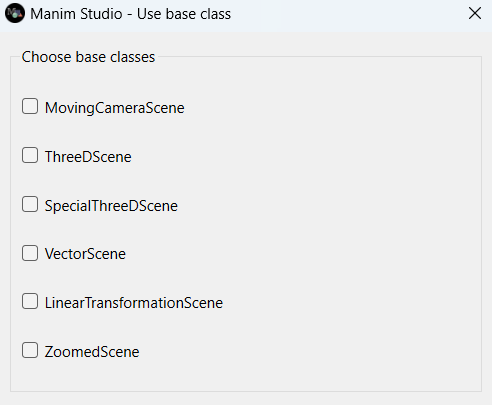
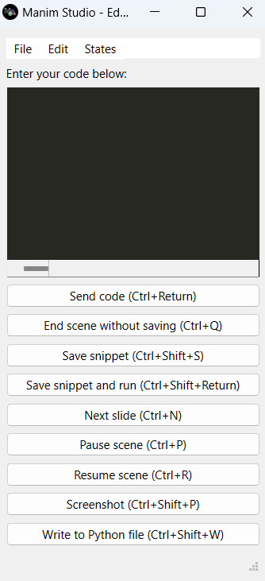
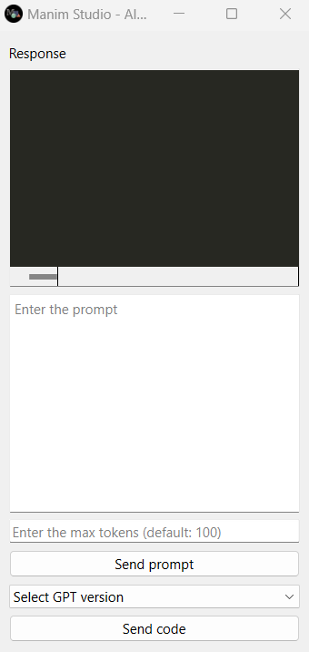

Getting started
===============

If you want to learn about Manim Studio, you must install it and try it out. Didn't you do it yet? Don't worry, it's very easy. Just follow the instructions at :doc:`installation`.

First tutorial
--------------

Now that you have installed Manim Studio, you can start learning how to use it.
Manim Studio can be used in two ways: as a library or as a command line tool.

To get started in the easiest way, we recommend you to use Manim Studio as a command line tool.

To do this, you must open a terminal and type the following command:

.. code-block:: bash

    manim-studio

If you have installed Manim Studio correctly, it should pop up a window like this:

This is the first dialog of Manim Studio. It asks for the kind of scene. It can be a normal ``Scene`` if you don't select anything, a ``MovingCameraScene`` if you select that option, or anything else. For now, close that dialog and let's begin with our first scene.

.. note::

    If you want to know more about the different kinds of scenes, you can read `the official Manim's documentation`_.

    .. _the official Manim's documentation: https://docs.manim.community/en/stable/reference_index/scenes.html

It will automatically open the preview window, an editor, a control panel and (if you've installed the AI feature) a OpenAI API prompt window.

    This is Manim Studio's preview window. It shows in real-time the scene you are working on.
    At the first time it is an empty black window, but it can change if you run code in the editor adding Mobjects to the scene or animating them.

    |

    This is Manim Studio's editor. It is where you write your code (with syntax highlighting included),
    save pieces of code as snippets, end the scene, etc.

    |

.. figure:: _static/images/control_panel.png
    :align: center

    This is Manim Studio's control panel. At the first time it is empty,
    but it will be filled with widgets to control scene properties graphically as you add them to your panel.

    |

    This is Manim Studio's OpenAI API prompt window (for users that have installed the AI features).
    It is where you can write your prompt to generate text with the OpenAI API.
    The first time you run it, it will ask your OpenAI key. See more about this in `OpenAI's page`_.

    .. _OpenAI's page: https://openai.com/blog/openai-api

    |

Now, let's write our first scene. In the editor, write the following code:

.. code-block:: python

    circ = Circle()
    self.play(Create(circ))

Now, press `Send Code` button or press ``Ctrl + Enter``. You should see a circle being drawn in the preview window.

.. video:: _static/images/first_animation.mp4
    :height: 400
    :loop:

Now you must press the `End Scene without saving` button or press ``Ctrl + Q`` to end the scene and generate the video output.
After you close all Manim Studio windows, you should see in the terminal a message with your video output path.
In that video, you should see the circle being drawn at some moment. If that's the case, you have done your first animation with Manim Studio!	

You can do much more interactively with Manim Studio! You can learn Manim through its `official documentation`_ or by many excellent tutorials at YouTube.

.. _official documentation: https://docs.manim.community/en/stable/index.html
