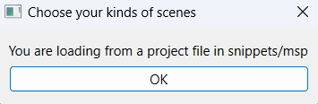
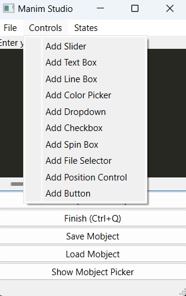
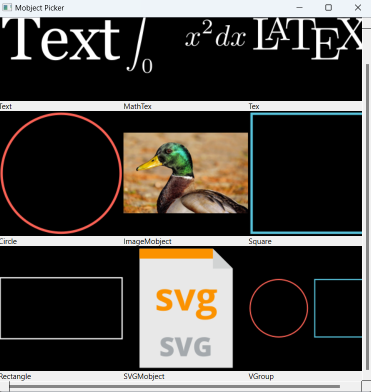
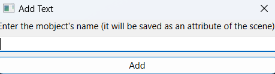
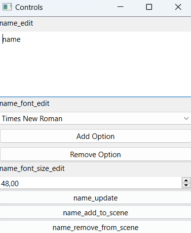
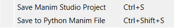

Getting Started
===============

Installation
------------
First of all, you will need to install Manim. You can check its documentation [here](https://docs.manim.community/en/stable/installation.html) and follow the instructions for your operating system there.
Secondly, you can install Manim Studio using ``pip``:

**Windows**

.. code-block:: bash

    pip install manim-studio

**MacOS/Linux**

.. code-block:: bash

    pip3 install manim-studio

CLI Usage
---------

Once you have installed Manim Studio, you can use it by running the following command:

.. code-block:: bash

    manim-studio

This will open the Manim Studio window in a new project. You can also open a specific project by running:

.. code-block:: bash

    manim-studio --from_project <path_to_project>

You can also include scenes made inside Python files in your project. To do so, you can run:

.. code-block:: bash

    manim-studio --file_name <path_to_file>

If you want to do both, you can run:

.. code-block:: bash

    manim-studio --from_project <path_to_project> --file_name <path_to_file>

You can also run Manim Studio from the command line by running:

.. code-block:: bash

    python -m manim_studio

And you can include the previous arguments as well to do something similar to the previous examples.

New Project
-----------
When you're creating a new project, you will be prompted with a window like this:

.. figure:: _static/images/new_project_first.png
    :align: center

    A prompt to select the kind of scene you want to work with and the project name.

You can select among many options Manim offers (or none if you only want to have the basic features), but also you can select the ones from a Python file using ``--file_name``. You can also select the project name, which will be the scene's name.

Existing Project
----------------
When you're opening an existing project with the file name specified in the command line, you will be prompted with a window like this:

    You must click the ``OK`` button to continue. If you close the window, the project will not be opened.

Working with Manim Studio
-------------------------
Once you have selected your scenes to work with if you're creating a new project or you have opened an existing one, it will show three windows like these:

.. figure:: _static/images/working_with_manim_studio.png
    :align: center

    The three windows you will see when you're working with Manim Studio. One is full-screen and black, which corresponds to the real-time preview of the scene, the left one that is not full-screen is the editor, and the right one is the control panel.

There're many features that currently Manim Studio offers, but many others are still in development. By the moment,
you may need some basic knowledge of Python to work with Manim Studio, but in the future, we will try to make it as
user-friendly as possible, to use a minimal scripting if you need to automate some tasks.

The code editor is the place where you will write your code, open the mobject picker to add Manim objects to your scene,
you have in the menu bar a section called ``Controls`` where you can add controls to your control panel, etc.

    The controls section in the menu bar. You can add any of these controls to your control panel.

You can access the values of the controls in your scene with any of these codes:

.. list-table:: Title
   :widths: 25 25 50
   :header-rows: 1

   * - Control type
     - Code
     - Description
   * - Slider
     - ``self.print_gui(self.<control-name>.get_value())``
     - Prompts the value of the slider in a GUI window. <control-name> is the value that you gave to the control when you added it to the control panel.
   * - Checkbox
     - ``self.print_gui(self.<control-name>.get_value())``
     - Prompts the value of the checkbox in a GUI window. <control-name> is the value that you gave to the control when you added it to the control panel.
   * - Textbox
     - ``self.print_gui(self.<control-name>.get_value())``
     - Prompts the value of the textbox in a GUI window. <control-name> is the value that you gave to the control when you added it to the control panel.
   * - Dropdown
     - ``self.print_gui(self.<control-name>.get_value())`` and ``self.print_gui(self.<control-name>_items.get_value())``
     - The first one prompts the value of the current text shown in the dropdown in a GUI window. The second one prompts the list of items in the dropdown in a GUI window. <control-name> is the value that you gave to the control when you added it to the control panel.
   * - Color Picker
     - ``self.print_gui(self.<control-name>.get_value())``
     - Prompts the value of the color picker in a GUI window. <control-name> is the value that you gave to the control when you added it to the control panel.
   * - File Chooser
     - ``self.print_gui(self.<control-name>.get_value())``
     - Prompts the value of the file name chosen in the file chooser in a GUI window. <control-name> is the value that you gave to the control when you added it to the control panel.
   * - Spin Box
     - ``self.print_gui(self.<control-name>.get_value())``
     - Prompts the value of the spin box in a GUI window. <control-name> is the value that you gave to the control when you added it to the control panel.
   * - Single-line textbox
     - ``self.print_gui(self.<control-name>.get_value())``
     - Prompts the value of the single-line textbox in a GUI window. <control-name> is the value that you gave to the control when you added it to the control panel.
   * - Position Control
     - ``self.print_gui(self.<control-name>.get_value())``
     - Prompts the value of the position control in a GUI window. <control-name> is the value that you gave to the control when you added it to the control panel.
   * - Button
     - It has no value, so you can't prompt anything.
     - It has no value, so you can't prompt anything.

You also have a Mobject Picker, which is a window where you can add Manim objects to your scene. We still only support a few of them, but we will add more in the future.

    The Mobject Picker window. You can add any of these mobjects to your scene.

You can click any of the images representing the mobject type you want to add to your scene, and it will prompt you for a name for the mobject. Then, you can click the ``Add`` button, and it will add the mobject to your scene.

    The Mobject Picker window prompting for a name for the mobject.

When you click ``Add``, it won't immediately show the mobject in your screen, but you can add it by clicking the ``Add to Scene`` button in the control panel.

    The Mobject Picker window after prompting for a name for the mobject. It's the control panel with new controls added.
    You need to click the ``Add to Scene`` button to show the mobject in your screen. The changes you make to the controls
    won't be applied until you click ``<mobject-name>_update``, which is a button that will be added to the control panel
    when you add a mobject to Manim Studio.

You can also add a mobject to your scene by writing the code in the editor. For example, if you want to add a red circle to your scene, you can write:

.. code-block:: python

    circle = Circle()
    self.add(circle)

And then, click ``Run (Ctrl + Return)``. It will add the circle to your scene, but if you want to control it, you have to either write code or add controls to the control panel manually and setup the code to control the mobject via the control panel.

You also can export to a Python file the entire code you have written in the editor by clicking the ``Save to Python Manim File`` button in the ``File`` menu in the editor, which will prompt you for a file name and then save the code to a Python file with the name you specified. It's not Manim Studio code, but you can render it with Manim CLI (see https://docs.manim.community/en/stable/guides/configuration.html for more information about how to use the Manim CLI).

    The options you have in the ``File`` menu in the editor.

If you want to continue your Manim Studio job later, you also can save the project by clicking the ``Save Manim Studio Project`` button in the ``File`` menu in the editor, which will prompt you for a file name and then save the project to a file without format, and if you have controls in your control panel, it will save a Pickle file that Manim Studio will use internally to load your project.

You can load a Manim Studio project using the Manim Studio CLI by running:

.. code-block:: bash

    manim-studio --from_project <path_to_project>

You can finish definitively your Manim Studio job by clicking the ``Finish (Ctrl+Q)``, which will show a message saying ``Finished`` in the status bar. Remember that you must close the windows manually!

Other interesting features
--------------------------
You can also save mobjects to a Pickle file by clicking the ``Save Mobject`` button in the editor, which will prompt you for the mobject name (if you added it via code, it's an attribute of ``self``) and then save the mobject to a Pickle file. You can load it later by clicking the ``Load Mobject`` button in the editor, which will prompt you for the Pickle file name and then for the name, which will be saved as an attribute of ``self``.
You can load mobjects in Manim too! You must import ``load_mobject`` from ``manim_studio.load_mobject`` and then use it like this:

.. code-block:: python

    mobject = load_mobject("<path_to_pickle_file>")
    self.add(mobject)

You can also use ``States`` stuff to do your jobs separately without opening new windows. You can add a new state, remove one or switch from one state to another to continue one job in its own way. Notice that states aren't included when saving Manim Studio projects, so you must save them separately.

All of this is available in the ``States`` menu in the editor.

In the future, we will add more features to Manim Studio, but for now, this is all we have. We hope you enjoy it!